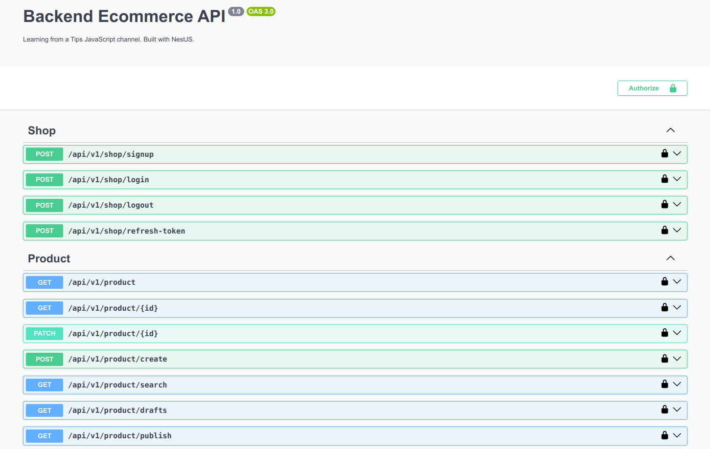

# Project Overview

## Learning from a Tips JavaScript channel. Built with NestJS.

## Technologies Used in the Project

### 1. Backend Frameworks:
- **Node.js**
- **NestJS**

### 2. Authentication and Authorization:
- **JWT** (JSON Web Tokens) for authentication.
- API Key and permissions middleware.
- Role-based access control system.

### 3. Database:
- **NoSQL Databases:**
  - **MongoDB** using Mongoose.

### 4. Caching and Messaging:
- **Redis:**
  - Data structures (String, Hash, List, Set, ZSet).
- **Message Queues:**
  - **Kafka**
  - **RabbitMQ** (message ordering, TTL, failure handling).

### 5. File Upload and Management:
- **Multer** for file handling.
- **Cloudinary** for cloud-based file storage and optimization.

### 6. Advanced API Features:
- **Factory Pattern** for dynamic API endpoints.
- **Polymorphic relationships** in Product API.
- Optimistic concurrency control with Redis.

### 7. Logging and Monitoring:
- **Discord** for logging API activities.

### 8. System Design:
- **Microservices architecture** with message queue integration.

### 9. API Documentation:
- **Swagger** for documenting RESTful APIs.

## Notable Features:
- **Nested comments system.**
- **SKU and SPU design** for eCommerce product data.
- Optimized **order and cart management**.
- **OTP email verification.**
- Scalable architecture with a focus on high performance and fault tolerance.

## Note list (Todos list)

- [x] Set up project structure and required packages.
- [x] Connect MongoDB to Node.js using Mongoose.
- [x] Implement multi-level `.env` configuration.
- [x] Sign up shop API ✅
- [x] Middleware
    - API key and permissions ✅
- [x] Error Handling
    - Handle API errors ✅
    - Standardize API responses with a class ✅
- [x] Write API login ✅
- [x] Write API logout ✅
- [x] Handle refresh token
    - Detect and mitigate reused tokens ✅
    - Improve token handling logic (Version 2) ✅
- [x] API Product
    - Create product schema ✅
    - Create new product using Factory Pattern ✅
    - Optimize product service for junior and senior levels ✅
    - Add features: `isDraft`, `isPublish`, and `unPublish` ✅
    - Add functionalities: `findAll`, `findOne`, `selectData`, `unSelectData` ✅
    - Update product via POST, PUT, PATCH ✅
- [x] API Inventory
    - Add stock to inventory ✅
- [x] Write API discount
    - Create inventory, discount model ✅
    - Get discount amount ✅
    - Get all discounts with product ✅
    - Create discount ✅
    - Get all discounts ✅
- [x] Write API cart
    - Add to cart ✅
    - Delete user item cart ✅
    - Get list of user cart ✅
    - Update quantity of item in cart ✅
- [x] Write API order
    - Using optimistic concurrency with Redis ✅
    - Checkout review ✅
- [x] Redis Integration
    - Manage Redis data structures (String, Hash, List, Set, ZSet) ✅
    - Implement transactions ✅
    - Configure Pub/Sub ✅
    - Handle TTL and server failure scenarios ✅
- [x] Logging API using Discord ✅
    - Push logs to Discord ✅
    - Test integration with Postman ✅
- [x] Nested Comments System ✅
- [x] Notification System
    - Send and verify notifications ✅
    - Analyze PUSH/PULL behavior ✅
    - Integrate with message queues ✅
- [x] Message Queue
    - Kafka and RabbitMQ integration ✅
    - Handle message errors and TTL ✅
    - Ensure message ordering in Pub/Sub and queues ✅
- [x] MySQL Optimization
    - Master-slave replication ✅
    - Generate 10 million test records ✅
    - Partition database for scalability ✅
    - Avoid common indexing mistakes ✅
- [x] File Upload
    - Configure Multer and Cloudinary ✅
- [x] AWS Deployment
    - S3 Bucket with security and performance optimization ✅
    - Use CloudFront for file protection ✅
    - Deploy and manage EC2 with MySQL and Linux ✅
    - CI/CD integration with GitHub and EC2 ✅
    - Configure Nginx with SSL and domain ✅
- [x] Roles and Permissions
    - Design system architecture ✅
    - Complete real-world implementation ✅
- [x] OTP Email Verification
    - Send OTP ✅
    - Verify OTP ✅
- [x] SKU and SPU System
    - Design and explain schema ✅
    - Implement controllers and services ✅
- [x] ElasticSearch Integration
    - Basic architecture ✅
    - Advanced search features ✅

## Setup package project

    - @golevelup/nestjs-rabbitmq: "^5.5.0"
    - @nestjs-modules/mailer: "^2.0.2"
    - @nestjs/common: "^10.0.0"
    - @nestjs/config: "^3.2.3"
    - @nestjs/core: "^10.0.0"
    - @nestjs/microservices: "^9.4.3"
    - @nestjs/mongoose: "^10.0.10"
    - @nestjs/platform-express: "^10.0.0"
    - @nestjs/swagger: "^7.4.0"
    - accesscontrol: "^2.2.1"
    - amqp-connection-manager: "^4.1.14"
    - amqplib: "^0.10.4"
    - bcrypt: "^5.1.1"
    - class-transformer: "^0.5.1"
    - class-validator: "^0.14.1"
    - cloudinary: "^2.5.1"
    - compression: "^1.7.4"
    - crypto: "^1.0.1"
    - discord.js: "^14.16.3"
    - dotenv: "^16.4.6"
    - helmet: "^7.1.0"
    - ioredis: "^5.4.1"
    - jsonwebtoken: "^9.0.2"
    - kafkajs: "^2.2.4"
    - lodash: "^4.17.21"
    - mongoose: "^8.5.0"
    - morgan: "^1.10.0"
    - multer: "^1.4.5-lts.1"
    - reflect-metadata: "^0.2.0"
    - rxjs: "^7.8.1"
    - slugify: "^1.6.6"
    - uuid: "^11.0.3"
    - winston: "^3.17.0"
    - winston-daily-rotate-file: "^5.0.0"